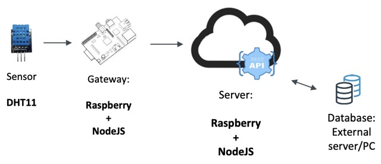

# IoT
repository per l'esame di IoT Unisalento

## ./code
- **A.2**: inviare dati ad un gateway/server tramite
  - *REST API (JSON format)*:

|metodo|URL|JSON|
|---|---|---|
|POST|/temperature|{"sensor":ID,
| | | "timestamp":123,
| | | "temp":20}|

- **B.1**: accettare HTTP/POST request:
  

- **B.2**: prendere dati ad una POST request
- **B.3**: salvare i dati in un db:
  